## Basic C++ sample usages of Magma library and Vulkan graphics API

## Cloning

To clone this repository with external submodules:
```
git clone --recursive https://github.com/vcoda/basic-graphics-samples.git
``` 
or clone this repository only and update submodules manually:
```
git clone https://github.com/vcoda/basic-graphics-samples.git
cd basic-graphics-samples
git submodule update --init --recursive
``` 

## Build tools and SDK

### Windows

* [Microsoft Visual Studio Community 2017](https://www.visualstudio.com/downloads/)<br>
* [Git for Windows](https://git-scm.com/download)<br>
* [LunarG Vulkan SDK](https://www.lunarg.com/vulkan-sdk/)<br>

Check that VK_SDK_PATH environment variable is present after SDK installation:
```
echo %VK_SDK_PATH%
```
Shaders are automatically compiled using glslangValidator as Custom Build Tool.

### Ubuntu Linux

Install GCC and Git (if not available):
```
sudo apt update
sudo apt install gcc
sudo apt install git
```
Install XCB headers and libraries:
```
sudo apt install xcb
sudo apt install libxcb-icccm4-dev
```
For Xlib, install X11 headers and libraries (optional):
```
sudo apt install libx11-dev
```

* [LunarG Vulkan SDK](https://www.lunarg.com/vulkan-sdk/)<br>

Go to the directory where .run file was saved:
```
chmod ugo+x vulkansdk-linux-x86_64-<version>.run
./vulkansdk-linux-x86_64-<version>.run
cd VulkanSDK/<version>/
source ./setup-env.sh
```
Check that Vulkan environment variables are present:
```
printenv | grep Vulkan
```

### Systems with AMD graphics hardware

Check whether AMDGPU-PRO stack is installed:
```
dpkg -l amdgpu-pro
```
If not, download and install it from an official web page:

* [AMD Radeon™ Software AMDGPU-PRO Driver for Linux](https://support.amd.com/en-us/kb-articles/Pages/AMDGPU-PRO-Install.aspx)<br>

NOTE: You have to make sure that graphics driver is compatible with current Linux kernel. Some of the driver's libraries are ***compiled*** against installed kernel headers, and if kernel API changed since driver release, compilation will fail and driver become malfunction after reboot. I used a combination of AMDGPU-PRO Driver Version 17.10 and Ubuntu 16.04.2 with kernel 4.8.0-36. Also disable system update as it may upgrade kernel to the version that is incompatible with installed graphics driver. 
Successfull AMDGPU-PRO installation should look like this:
```
Loading new amdgpu-pro-17.10-446706 DKMS files...
First Installation: checking all kernels...
Building only for 4.8.0-36-generic
Building for architecture x86_64
Building initial module for 4.8.0-36-generic
Done.
Forcing installation of amdgpu-pro
```
After reboot check that driver stack is installed:
```
dpkg -l amdgpu-pro
Desired=Unknown/Install/Remove/Purge/Hold
| Status=Not/Inst/Conf-files/Unpacked/halF-conf/Half-inst/trig-aWait/Trig-pend
|/ Err?=(none)/Reinst-required (Status,Err: uppercase=bad)
||/ Name                            Version              Architecture         Description
+++-===============================-====================-====================-====================================================================
ii  amdgpu-pro                      17.10-446706         amd64                Meta package to install amdgpu Pro components.
```

To build all samples, go to the repo root directory and run Make script:
```
make magma
make all
```
or to build particular sample, type
```
make <NN-sample-name>
```
Optionally use can use -jN flag (where N is the number of threads) to run multi-threaded compilation.
There is debug build by default. For release build, set DEBUG variable to false, e. g.:
```
make all DEBUG=0
```

### Android

* [Android Studio](https://developer.android.com/studio/index.html)<br>
* [Android NDK](https://github.com/android-ndk/ndk/wiki)<br>
TODO

### macOS and iOS

* [XCode](https://developer.apple.com/xcode/)<br>
* [MoltenVK](https://github.com/KhronosGroup/MoltenVK)<br>
TODO

## Examples

### [01 - Clear framebuffer](01-clear/)
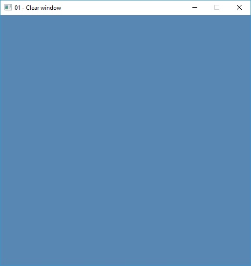
Shows how to setup command buffer for simple framebuffer clear.
<br><br><br><br><br>

### [02 - Triangle](02-simple-triangle/)
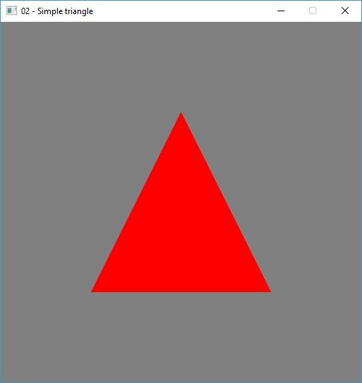
Draws triangle primitive from vertices generated in vertex shader.
<br><br><br><br><br>

### [03 - Vertex buffer](03-vertex-buffer/)
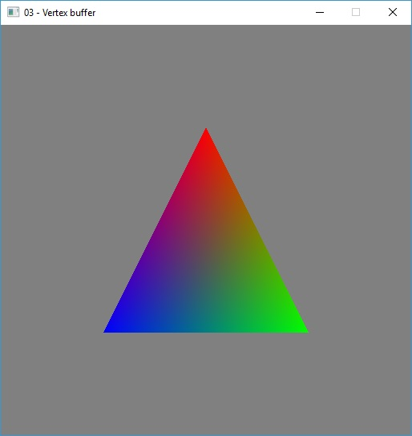
Draws triangle primitive with per-vertex colors using vertex buffer.
<br><br><br><br><br>

### [04 - Vertex transform](04-vertex-transform/)
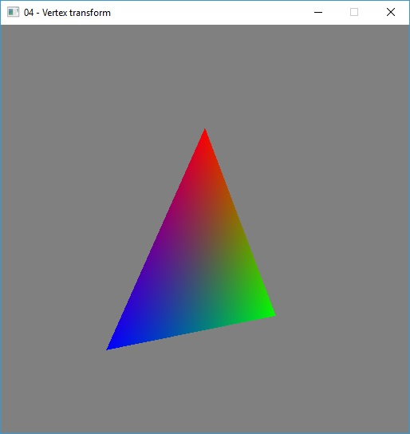
Shows how to setup perspective transformation and apply it to vertices in the vertex shader.
<br><br><br><br><br>

### [05 - Mesh](05-mesh/)
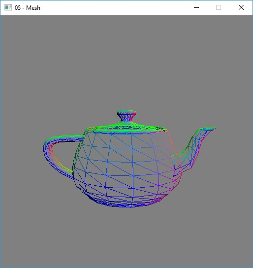
Generates famous Utah Teapot from the set of patches and draws wireframe mesh with perspective transformation.
Smoothness of the surface could be controlled using subdivision degree.
<br><br><br><br>

### [06 - Texture](06-texture/)
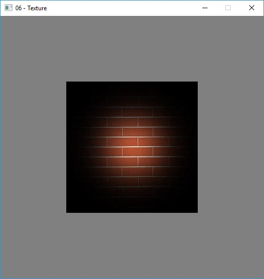
Shows how to load DXT texture data (using Gliml library), create Vulkan images and combine them in the fragment shader using samplers.
<br><br><br><br>

### [07 - Texture array](07-texture-array/)
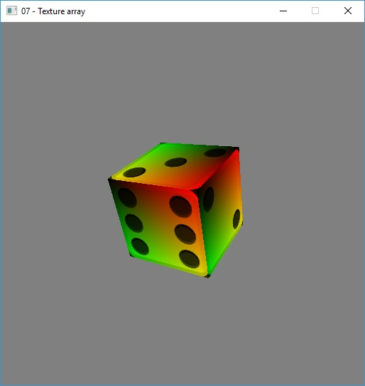
Utilizes "texture array" hardware feature to apply multiple textures inside single draw call.
Different texture LODs could be viewed.
<br><br><br><br>

### [08 - CubeMap](08-cubemap/)
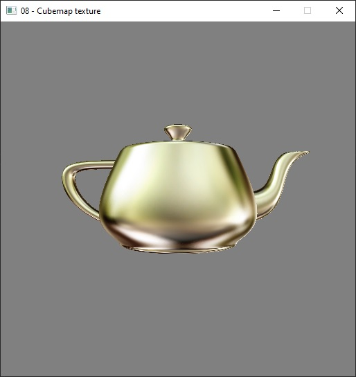
Shows how to load DXT cubemap textures and perform environment mapping in fragment shader.
<br><br><br><br><br>

### [09 - Alpha blending](09-alpha-blend/)
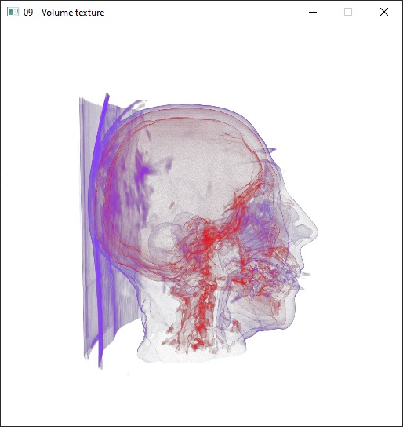
Good old alpha blending.
<br><br><br><br><br>

### [10 - Render to texture](10-render-to-texture/)
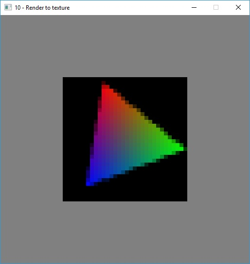
Performs render to multisampled texture and resolve operation using RenderPass.
Looks like AMD hardware uses compute queue for resolving, because it slows down my machine when ethereum miner is running.
<br><br><br>

### [11 - Occlusion query](11-occlusion-query/)
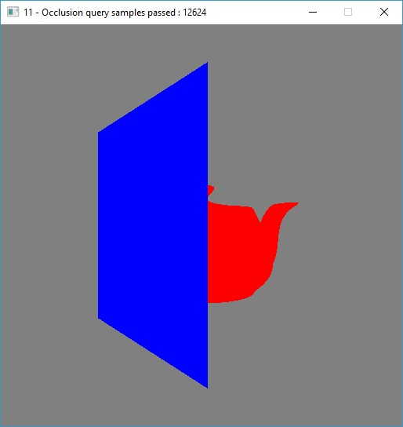
Simplest usage of hardware occlusion queries.
<br><br><br><br><br>

### [12 - Push constants](12-pushconstants/)
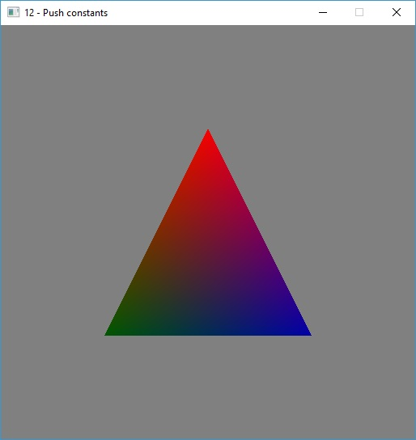
Shows how to use push constants - a limited register file inside GPU. Push constants are updated when command buffer is sent to GPU.
<br><br><br><br>

### [13 - Specialization constants](13-specialization/)
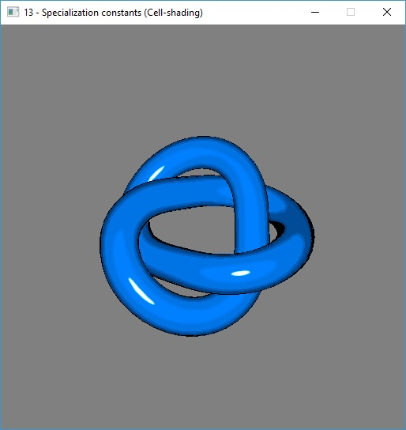
Shows how to force shader compiler to perform static branching using specialization constants.
For each fragment shader branch, there is a separate pipeline instance.
<br><br><br><br>

### [14 - Particles](14-particles/)
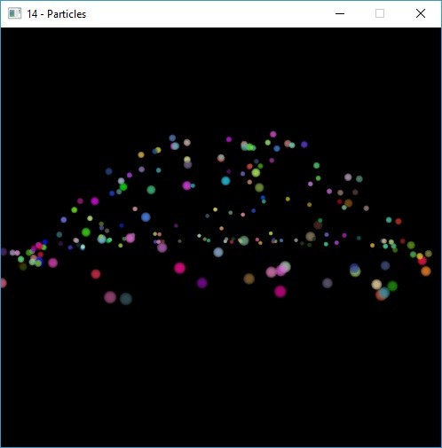
This sample shows how to use gl_PointSize built-in variable to draw particles that are properly scaled with distance.
As number of particles varies, vertex count put to indirect buffer to fetch from instead of specify it in vkCmdDraw() function with command buffer rebuild.
Particle engine initially implemented by Kevin Harris and adopted by me for rendering with Vulkan.
<br><br>

### [15 - Compute shader](15-compute/)
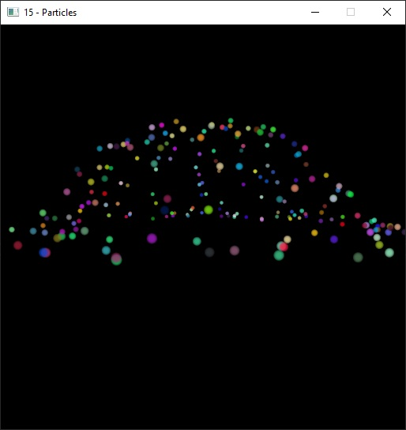
Compute shaders are core part of Vulkan. This sample performs arithmetic computations on two set of numbers using GPU compute shader.
<br><br>

### [16 - Immediate mode](16-immediate/)
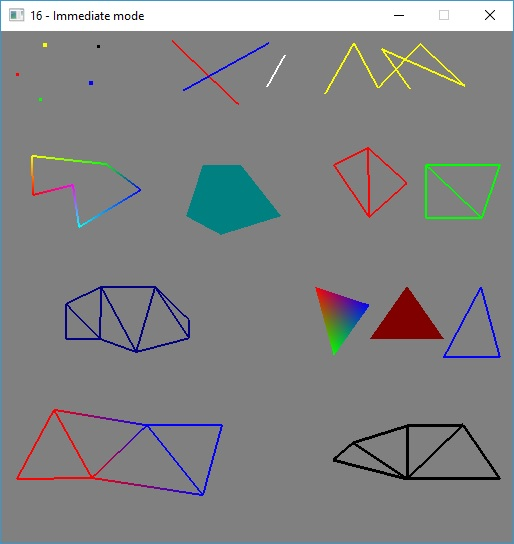
Sometimes I miss immediate render mode from OpenGL 1.x era, apparently it was useful to (quickly) draw something on the screen.
This sample shows how to use Magma's immediate render to draw different primitives without VB mapping, data copy, state management etc.
<br><br><br><br>

### [17 - ShaderToy](17-shadetoy/)
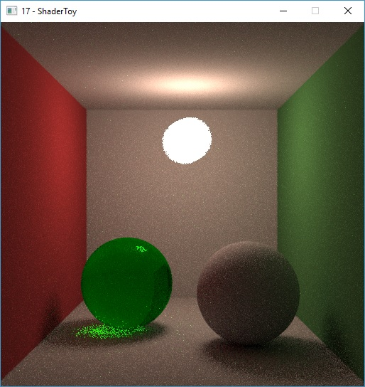
Unlike OpenGL, where shader compiler is provided by the graphics driver, Vulkan uses pre-compiled SPIR-V bytecode.
This sample shows how to use https://github.com/google/shaderc compiler from Google to compile GLSL shaders on fly 
and apply changes immediately, which may be useful for shader development. Example fragment shader taken from 
https://www.shadertoy.com/view/4tl3z4 (written by Reinder Nijhofftaken).
<br><br>

## Known issues

* Negative viewport height may not work on Intel integrated GPU's despite support of VK_KHR_maintenance1 extension.
* vkCreateSwapchainKHR() may fail on Linux due to unknown issues with alignment.

## Credits
This framework uses a few third-party libraries:

* [Microsoft DirectXMath](https://github.com/Microsoft/DirectXMath)<br>
  Linear algebra library with fantastic CPU optimizations using SSE2/SSE3/SSE4/AVX/AVX2 intrinsics.<br>
  I wrote a simple [wrapper](https://github.com/magma-lib/rapid) over it to make its usage more OOP friendly.

* [Gliml](https://github.com/floooh/gliml)<br>
  Minimalistic image loader library by [Andre Weissflog](https://github.com/floooh).
